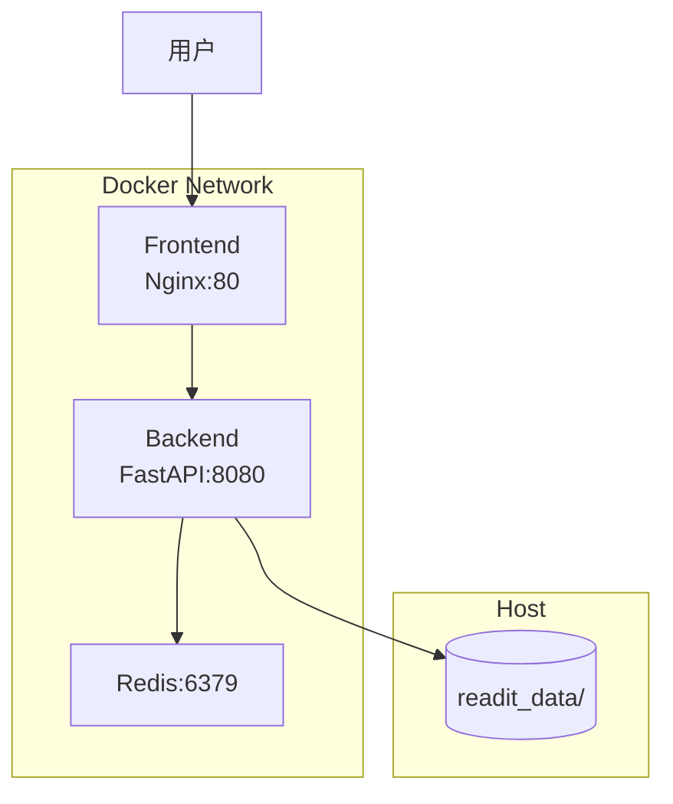

# Read it DEEP - Docker 部署指南

本文档介绍如何使用 Docker Compose 部署 Read it DEEP 应用。

---

## 目录

1. [快速开始](#快速开始)
2. [端口配置](#端口配置)
3. [持久化数据](#持久化数据)
4. [环境变量配置](#环境变量配置)
5. [数据迁移](#数据迁移)
6. [常用命令](#常用命令)
7. [故障排查](#故障排查)

---

## 快速开始

### 前置要求

- Docker 20.10+
- Docker Compose V2

### 一键启动

```bash
# 1. 配置环境变量
cp .env.docker.example .env
# 编辑 .env 填写 API Keys

# 2. 启动服务
./docker-start.sh

# 访问应用
# Frontend: http://localhost:3000
# Backend:  http://localhost:8080
# API Docs: http://localhost:8080/docs
```

### 停止服务

```bash
./docker-stop.sh
```

---

## 使用预构建镜像部署

如果不想在目标服务器上重新构建，可以使用导出的镜像：

### 在开发机上导出镜像

```bash
# 镜像已导出到 docker-images/ 目录
ls -lh docker-images/
# backend.tar.gz  (401MB)
# frontend.tar.gz (22MB)
# redis.tar.gz    (16MB)
```

### 在目标服务器上部署

```bash
# 1. 上传文件到服务器
scp -r docker-images .env docker-compose.yml docker-start.sh docker-stop.sh docker-load-images.sh user@server:/path/to/app/

# 2. 在服务器上加载镜像
./docker-load-images.sh

# 3. 启动服务
./docker-start.sh
```

> 💡 使用预构建镜像可跳过构建步骤，直接启动服务

---

## GitHub Actions 自动构建 (CI/CD)

项目配置了 GitHub Actions，每次推送到 `main` 分支时自动构建并发布镜像到 GHCR。

### 工作流程

1. **触发条件**: 推送到 `main`/`master` 分支，或手动触发
2. **构建内容**: Backend 和 Frontend 两个镜像
3. **发布位置**: `ghcr.io/<owner>/readitdeep-backend` 和 `ghcr.io/<owner>/readitdeep-frontend`

### 配置步骤

1. **确保仓库启用 GitHub Actions**

2. **设置仓库 Packages 权限**
   - 仓库 Settings → Actions → General → Workflow permissions
   - 选择 "Read and write permissions"

3. **推送代码触发构建**
   ```bash
   git add .
   git commit -m "feat: update"
   git push origin main
   ```

4. **在 Actions 页面查看构建状态**

### 使用 GHCR 镜像部署

```bash
# 设置你的 GitHub 用户名
export GITHUB_OWNER=your-username

# 使用 GHCR 部署脚本
./docker-deploy-ghcr.sh $GITHUB_OWNER latest

# 或手动拉取
docker pull ghcr.io/$GITHUB_OWNER/readitdeep-backend:latest
docker pull ghcr.io/$GITHUB_OWNER/readitdeep-frontend:latest
docker compose -f docker-compose.ghcr.yml up -d
```

---

## 端口配置

可通过脚本参数或环境变量自定义端口：

```bash
# 方式1: 脚本参数
./docker-start.sh [前端端口] [后端端口] [Redis端口]

# 示例: 前端 8000, 后端 9000
./docker-start.sh 8000 9000

# 方式2: 环境变量
export FRONTEND_PORT=8000
export BACKEND_PORT=9000
docker compose up -d --build
```

| 服务 | 默认端口 | 环境变量 |
|-----|---------|---------|
| Frontend | 3000 | `FRONTEND_PORT` |
| Backend | 8080 | `BACKEND_PORT` |
| Redis | 6379 | `REDIS_PORT` |

---

## 持久化数据

所有持久化数据存储在 `./readit_data/` 目录：

```
readit_data/
├── db/                     # 数据库和配置文件
│   ├── readitdeep.db       # SQLite 数据库
│   ├── papers.json         # 论文分析结果
│   ├── workbench.json      # 工作台内容
│   └── token_stats.json    # Token 统计
├── uploads/                # 用户上传文件
│   └── <user-id>/          # 按用户 ID 分目录
│       ├── *.pdf           # 原始 PDF
│       ├── *.zip           # Mineru 解析结果
│       ├── *.md            # 提取的 Markdown
│       └── content_list.json
├── redis/                  # Redis 持久化数据
└── logs/                   # 分析日志 (预留)
```

> ⚠️ **重要**: 备份数据时请备份整个 `readit_data/` 目录

---

## 环境变量配置

复制模板并编辑：

```bash
cp .env.docker.example .env
```

### 必须配置

| 变量 | 说明 |
|-----|------|
| `LLM_API_KEY` | LLM 服务 API Key |
| `LLM_BASE_URL` | LLM 服务地址 |
| `MINERU_API_KEY` | MinerU PDF 解析服务 Token |
| `SECRET_KEY` | 应用密钥 (生产环境必须修改) |

### 可选配置

详见 [.env.docker.example](../.env.docker.example) 文件中的完整配置说明。

---

## 数据迁移

### 从本地开发迁移到 Docker

启动脚本会自动检测并迁移 `backend/data/` 中的数据。

手动迁移：

```bash
# 迁移数据库和配置
cp backend/data/readitdeep.db readit_data/db/
cp backend/data/papers.json readit_data/db/
cp backend/data/workbench.json readit_data/db/
cp backend/data/token_stats.json readit_data/db/

# 迁移用户上传
cp -r backend/data/uploads/* readit_data/uploads/
```

### 备份数据

```bash
# 创建时间戳备份
tar -czf readit_backup_$(date +%Y%m%d_%H%M%S).tar.gz readit_data/
```

---

## 常用命令

```bash
# 查看服务状态
docker compose ps

# 查看日志
docker compose logs -f              # 所有服务
docker compose logs -f backend      # 仅后端
docker compose logs -f frontend     # 仅前端

# 重启单个服务
docker compose restart backend

# 重新构建并启动
docker compose up -d --build

# 完全清理 (保留数据)
docker compose down

# 完全清理 (包括 Redis 数据卷)
docker compose down -v

# 进入容器调试
docker compose exec backend bash
docker compose exec redis redis-cli
```

---

## 故障排查

### 服务无法启动

```bash
# 检查日志
docker compose logs --tail=100

# 检查容器状态
docker compose ps -a
```

### 端口被占用

```bash
# 查找占用端口的进程
lsof -i :3000
lsof -i :8080

# 使用其他端口启动
./docker-start.sh 4000 9000
```

### 数据目录权限问题

```bash
# 修复权限
chmod -R 755 readit_data/
```

### 健康检查失败

```bash
# 检查后端健康状态
curl http://localhost:8080/health

# 检查 Redis 连接
docker compose exec redis redis-cli ping
```

### 镜像拉取失败

如果 GHCR 镜像拉取失败，可临时切换回 Docker Hub：

```yaml
# docker-compose.yml 中修改 redis 镜像
redis:
  image: redis:7-alpine  # Docker Hub 镜像
```

---

## 服务架构



---

> 📝 **更新日期**: 2025-12-18
