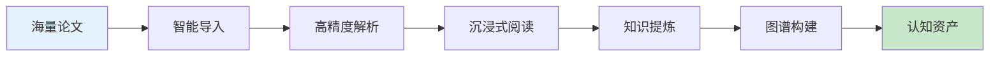
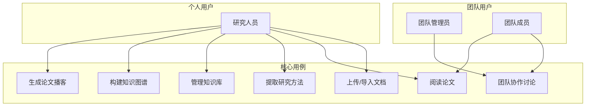
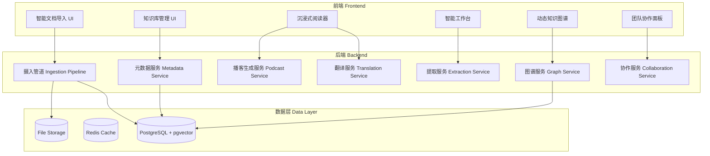
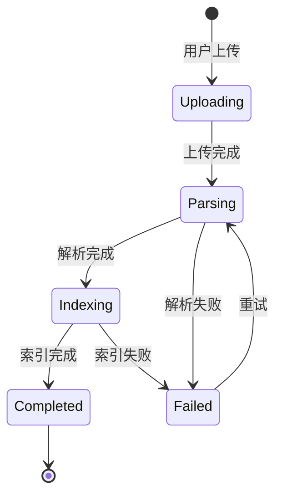
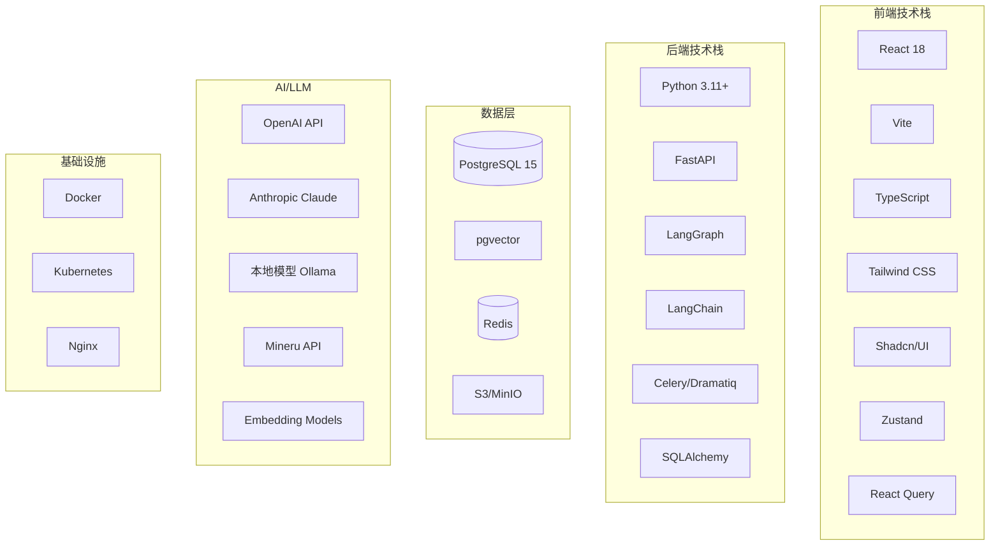
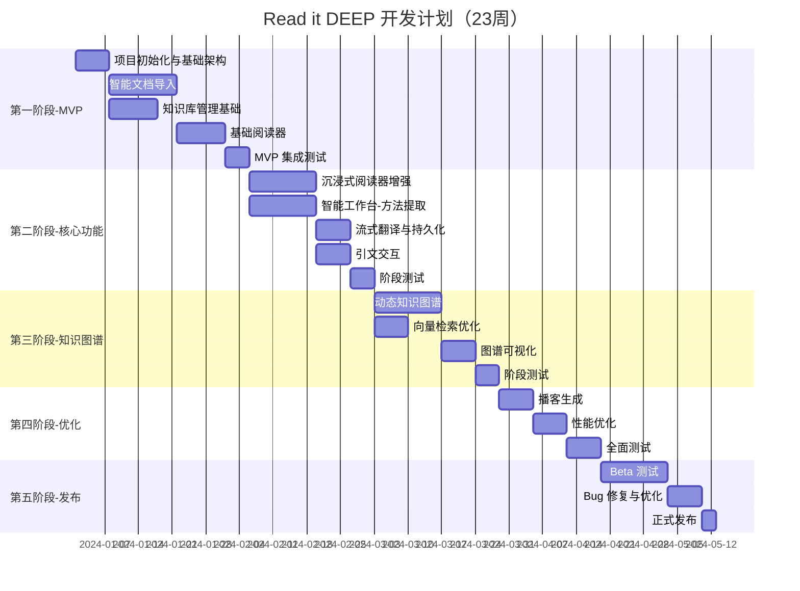

# Read it DEEP - 详细需求分析与开发计划

## 1. 产品定位与目标

### 1.1 产品愿景
Read it DEEP 是一个 **AI 驱动的深度阅读与知识资产管理平台**，定位为：
- 🎯 **认知过程记录仪**：记录用户的阅读路径、思考过程和知识提炼
- 🏭 **科研资产提炼工厂**：从海量论文中自动提取方法、数据与灵感
- 🕸️ **动态知识图谱**：构建个人/团队的知识网络

### 1.2 目标用户群体

| 用户角色 | 用户画像 | 核心需求 |
|---------|---------|---------|
| **科研人员** | 博士生、博士后、高校教师 | 大量文献阅读、方法对比、灵感记录 |
| **研究团队** | 科研团队、实验室 | 协作阅读、知识共享、讨论交流 |
| **技术从业者** | 算法工程师、研发人员 | 追踪前沿技术、提取可复现代码 |
| **独立研究者** | 独立学者、行业分析师 | 系统化知识管理、跨领域关联 |

### 1.3 核心价值主张



---

## 2. 用户角色与用例分析

### 2.1 用例图



### 2.2 详细用例描述

#### UC1: 智能文档导入
| 要素 | 描述 |
|------|------|
| **参与者** | 研究人员 |
| **前置条件** | 用户已登录系统 |
| **主要流程** | 1. 用户选择本地文件上传（MVP 阶段仅支持本地上传）<br>2. 系统接收文档，返回占位卡片<br>3. 后台异步解析（Mineru API）<br>4. 前端轮询更新状态<br>5. 解析完成，卡片可点击打开 |
| **异常流程** | API 失败时自动下载 ZIP 回退解析 |
| **后置条件** | 文档加入知识库，元数据已补全 |

#### UC2: 沉浸式阅读
| 要素 | 描述 |
|------|------|
| **参与者** | 研究人员 |
| **前置条件** | 文档已解析完成 |
| **主要流程** | 1. 用户点击打开论文<br>2. 三栏布局加载（图谱-正文-工作台）<br>3. 用户阅读，可触发翻译/引文悬浮<br>4. 用户选中文本，拖拽至工作台<br>5. 可切换 Zen 模式全屏阅读 |
| **后置条件** | 阅读进度和轨迹被记录 |

#### UC3: 知识提炼
| 要素 | 描述 |
|------|------|
| **参与者** | 研究人员 |
| **前置条件** | 用户正在阅读论文 |
| **主要流程** | 1. 用户选中方法/公式/代码片段<br>2. 拖拽至对应"车间"<br>3. AI 自动提取结构化信息<br>4. LangGraph 回环验证<br>5. 用户确认或修正<br>6. 资产存入知识库 |
| **后置条件** | 结构化资产（Method Card/Dataset Card）已保存 |

---

## 3. 功能模块细化

### 3.1 模块总览



### 3.2 模块功能详细分解

---

#### 模块一：智能文档导入 (Smart Ingestion)

> [!NOTE]
> MVP 阶段仅支持本地上传，URL/Zotero/Drive 导入将在后续版本开发。

| 子功能 | 功能描述 | 优先级 | 技术要点 |
|--------|---------|--------|---------|
| 本地上传 | 支持 PDF/LaTeX/Word 文件上传 | P0 | 文件类型校验，大小限制 |
| URL 导入 | 从 URL 下载论文（ArXiv/PDF 链接） | **P2** | HTTP 请求，重定向处理（后期开发） |
| Zotero 同步 | 连接 Zotero 库，同步文献 | **P3** | Zotero API 集成（后期开发） |
| Google Drive 监听 | 监听指定文件夹变化，自动导入 | **P3** | Google Drive API，Webhook（后期开发） |
| Mineru 解析 | 调用 Mineru V4 API 解析 PDF | P0 | 在线 API（1000页/天），可自建服务 |
| 图片提取 | 从 PDF 提取图片并存储 | P0 | 图片路径重写 |
| 进度反馈 | 实时显示解析进度 | P0 | 轮询 /api/monitor |

**状态机设计：**


---

#### 模块二：知识库管理 (Library Management)

| 子功能 | 功能描述 | 优先级 | 技术要点 |
|--------|---------|--------|---------|
| 文献列表 | 分页展示所有文献卡片 | P0 | 虚拟滚动，Optimistic UI |
| 元数据补全 | 自动从 DOI/ArXiv 获取元数据 | P0 | CrossRef/S2/ArXiv API |
| LLM 兜底 | 无 ID 时调用 LLM 提取**标题+类别** | P0 | 用于 Library 分类和标题更新 |
| 分类管理 | 按论文类别分组展示 | P0 | 类别自动识别 + 手动调整 |
| 搜索过滤 | 按标题/作者/关键词搜索 | P0 | 全文搜索 + 向量搜索 |
| 批量操作 | 批量删除、导出、标签管理 | P1 | 批量 API 设计 |
| 操作锁定 | 处理中的文件锁定操作 | P0 | 状态管理 |

---

#### 模块三：沉浸式阅读器 (Zen Reader)

> [!IMPORTANT]
> 翻译结果需持久化存储，避免重复翻译。UI 需提供「已翻译」状态标识。

| 子功能 | 功能描述 | 优先级 | 技术要点 |
|--------|---------|--------|---------|
| Markdown 渲染 | 高性能 Markdown 渲染 | P0 | react-markdown, KaTeX, Mermaid |
| 三栏布局 | 图谱-正文-工作台响应式布局 | P0 | CSS Grid/Flexbox |
| Zen 模式 | 全屏沉浸式阅读 | P1 | Fullscreen API |
| 智能引文 | 引用悬浮预览和跳转 | P0 | useMemo 解析，Popover 组件 |
| 流式翻译 | 异步分块翻译，**结果持久化** | P0 | SSE 流式传输，翻译结果存数据库 |
| 译文切换 | 原文/译文无缝切换 | P0 | 状态持久化，显示「已翻译」标识 |
| 论文播客 | 一键生成双人对话音频 | P2 | Podcastfy 集成 |
| 阅读进度 | 记录阅读位置 | P1 | LocalStorage + 服务端同步 |

---

#### 模块四：智能工作台 (Workbench)

| 子功能 | 功能描述 | 优先级 | 技术要点 |
|--------|---------|--------|---------|
| 磁吸式投料 | 拖拽内容自动识别车间 | P0 | Drag & Drop API，内容分类 |
| **方法炼金台** | 提取算法参数、Loss 公式 | P0 | LLM 结构化提取 |
| ├─ 伪代码生成 | 生成 PyTorch 伪代码 | P1 | Code LLM |
| └─ 方法 Diff | 与其他论文方法对比 | P2 | Diff 算法 |
| **资产仓库** | 验证数据集 URL | P1 | HTTP HEAD 请求 |
| ├─ License 抓取 | 自动抓取 License 信息 | P1 | 网页解析 |
| └─ SOTA 排名 | 获取基准排名 | P2 | Papers with Code API |
| **灵感画板** | 假设分叉记录 | P1 | 双向链接笔记 |
| LangGraph 验证 | AI 提取 → 验证 → 重试 → 确认 | P0 | LangGraph 回环设计 |

---

#### 模块五：动态知识图谱 (Knowledge Graph)

| 子功能 | 功能描述 | 优先级 | 技术要点 |
|--------|---------|--------|---------|
| 外部层 - 引用关系 | 基于 S2 数据展示引用 | P0 | Semantic Scholar API |
| 幽灵节点 | 未收录但高频引用的论文 | P1 | 虚线样式，点击下载 |
| 内部层 - 相似度 | 基于向量相似度连接 | P0 | pgvector 相似度查询 |
| 上下文联动 | 阅读章节自动高亮节点 | P1 | 章节检测，实时同步 |
| 图谱可视化 | 力导向图交互 | P0 | D3.js / React Flow |

---

#### 模块六：团队协作 (Collaboration)

> [!WARNING]
> 团队协作模块优先级下放，列入后期 TODO，MVP 阶段不开发。

| 子功能 | 功能描述 | 优先级 | 技术要点 |
|--------|---------|--------|---------|
| 认知流记录 | 记录视口停留、交互历史 | **P3** | 事件追踪（后期） |
| 思维回放 | 查看成员得出结论的过程 | **P3** | 时间线可视化（后期） |
| 上下文聊天 | 论文维度的讨论室 | **P3** | WebSocket 实时通信（后期） |
| 段落引用 | 聊天中引用正文段落 | **P3** | 段落选择器（后期） |
| 冲突检测 | AI 检测相反笔记并提示 | **P3** | LLM 语义对比（后期） |

---

## 4. 非功能性需求

### 4.1 性能需求

| 指标 | 目标值 | 备注 |
|------|--------|------|
| 页面首屏加载 | < 2s | 核心 Web Vitals |
| PDF 解析时间 | **1-2 分钟/篇（异步）** | Mineru 在线 API，UI 需给用户进度提示 |
| 翻译响应时间 | 首 Token < 1s | 流式传输 |
| 知识库检索 | < 500ms | pgvector 索引优化 |
| 图谱渲染 | 1000 节点无卡顿 | 虚拟化 + WebGL |
| 并发用户 | 100+ | 水平扩展 |

### 4.2 可靠性需求

| 需求 | 描述 |
|------|------|
| 断点续传 | 服务重启后任务可恢复 |
| 数据一致性 | 文件处理期间锁定操作 |
| 错误回退 | Mineru 失败自动 ZIP 回退 |
| 备份恢复 | 每日自动备份 |

### 4.3 安全需求

| 需求 | 描述 |
|------|------|
| 身份认证 | JWT Token 认证 |
| 权限控制 | RBAC 角色权限 |
| 数据隔离 | 多租户数据隔离 |
| 文件访问 | 静态资源鉴权 |

---

## 5. 技术选型方案

### 5.1 技术栈总览



### 5.2 详细技术选型

#### 5.2.1 前端技术栈

| 技术 | 选型 | 选择理由 |
|------|------|---------|
| **框架** | React 18 | 成熟生态，并发特性，团队熟悉 |
| **构建工具** | Vite | 极速 HMR，ESM 原生支持 |
| **类型系统** | TypeScript | 类型安全，IDE 支持，重构友好 |
| **样式方案** | Tailwind CSS | 原子化 CSS，设计系统一致性 |
| **UI 组件** | Shadcn/UI | 可定制，无运行时依赖 |
| **状态管理** | Zustand | 轻量，无 boilerplate |
| **异步状态** | React Query | 缓存、重试、乐观更新 |
| **Markdown** | react-markdown | 可扩展，插件生态 |
| **数学公式** | KaTeX | 高性能，比 MathJax 快 |
| **图表** | Mermaid | 文本驱动图表 |
| **图谱可视化** | React Flow / D3.js | 力导向图，交互丰富 |
| **拖拽** | @dnd-kit | React 原生，accessible |

#### 5.2.2 后端技术栈

| 技术 | 选型 | 选择理由 |
|------|------|---------|
| **语言** | Python 3.11+ | AI/ML 生态，LangChain 原生 |
| **Web 框架** | FastAPI | 异步支持，自动文档，类型安全 |
| **工作流引擎** | LangGraph | 状态机管理，断点续传，回环 |
| **LLM 框架** | LangChain | 统一 LLM 接口，工具链完善 |
| **任务队列** | Celery + Redis | 成熟稳定，支持定时任务 |
| **ORM** | SQLAlchemy 2.0 | 异步支持，类型提示 |
| **PDF 解析** | Mineru API | 高精度，布局保持 |
| **播客生成** | Podcastfy | 论文转播客 |

#### 5.2.3 数据存储

| 技术 | 选型 | 用途 |
|------|------|-----|
| **主数据库** | PostgreSQL 15 | 核心业务数据 |
| **向量扩展** | pgvector | 段落向量，语义检索 |
| **半结构化** | JSONB | Method Card, Dataset Card |
| **缓存** | Redis | 会话、任务状态、热数据 |
| **文件存储** | **本地存储（默认）+ S3 可选** | PDF、图片、音频；后期可配置 S3 协议存储 |
| **搜索引擎** | (可选) Meilisearch | 全文搜索增强 |

#### 5.2.4 AI/LLM 集成

> [!IMPORTANT]
> **配置管理**：使用 `.env` 文件统一管理 `BASE_URL` 和 `API_KEY`，按功能分类配置不同模型。

| 能力 | 技术选型 | 备注 |
|------|---------|-----|
| **通用 LLM** | **本地 vLLM（OpenAI 兼容）/ 火山引擎 API** | 主力模型，高质量输出 |
| **快速任务** | vLLM 部署的轻量模型 | 低延迟，低成本 |
| **本地部署** | **vLLM 服务（已部署）** | Qwen/Llama 等模型 |
| **Embedding** | **在线模型 / 本地模型可切换** | 切换时需重新全文向量化 |
| **PDF 解析** | Mineru V4 API（在线，1000页/天） | 后期可自建 Mineru 服务 |
| **翻译** | **本地 vLLM（OpenAI 兼容接口）** | 翻译结果持久化存储 |

**环境变量配置示例：**
```bash
# 通用 LLM 配置
LLM_BASE_URL=http://localhost:8000/v1
LLM_API_KEY=your-key

# 翻译专用 LLM
TRANSLATION_BASE_URL=http://localhost:8000/v1
TRANSLATION_MODEL=qwen2.5-72b

# Embedding 配置
EMBEDDING_PROVIDER=local  # 或 openai
EMBEDDING_BASE_URL=http://localhost:8000/v1
EMBEDDING_MODEL=bge-m3

# Mineru 配置
MINERU_API_URL=https://api.mineru.com
MINERU_API_KEY=your-key
```

#### 5.2.5 基础设施

| 技术 | 选型 | 用途 |
|------|------|-----|
| **容器化** | Docker | 环境一致性 |
| **编排** | Docker Compose / K8s | 开发/生产环境 |
| **反向代理** | Nginx / Traefik | 负载均衡，SSL |
| **CI/CD** | GitHub Actions | 自动化部署 |
| **监控** | Prometheus + Grafana | 性能监控 |
| **日志** | ELK / Loki | 日志聚合 |

---

## 6. 开发计划

### 6.1 阶段划分



### 6.2 详细里程碑

---

#### 🏁 第一阶段：MVP 基础版 (6 周)

**目标**：完成核心上传-解析-阅读流程

| 周次 | 任务 | 交付物 |
|------|------|--------|
| W1 | 项目初始化 | 前后端脚手架、数据库设计、CI/CD |
| W2-3 | 智能文档导入 | Mineru 集成、上传 UI、状态轮询 |
| W3-4 | 知识库管理 | 列表页、元数据补全、搜索 |
| W4-5 | 基础阅读器 | Markdown 渲染、三栏布局 |
| W6 | MVP 集成测试 | 端到端测试、Bug 修复 |

**里程碑验收标准**：
- ✅ 用户可上传 PDF，系统自动解析
- ✅ 显示解析进度，完成后可打开阅读
- ✅ Markdown 正确渲染（公式、代码、图片）
- ✅ 知识库列表展示，支持搜索

---

#### 🚀 第二阶段：核心功能增强 (6 周)

**目标**：完成阅读器核心交互和工作台基础

| 周次 | 任务 | 交付物 |
|------|------|--------|
| W7-8 | 沉浸式阅读器 | Zen 模式、智能引文解析 |
| W8-9 | 流式翻译 | SSE 翻译、译文切换 |
| W9-10 | 智能工作台 | 磁吸投料、方法炼金台 |
| W11 | LangGraph 集成 | 回环验证工作流 |
| W12 | 阶段测试 | 集成测试、性能测试 |

**里程碑验收标准**：
- ✅ 引文悬浮预览、点击跳转
- ✅ 流式翻译，原文/译文切换
- ✅ 拖拽内容到工作台，自动提取结构化信息
- ✅ 提取过程支持 AI 验证和重试

---

#### 🕸️ 第三阶段：知识图谱 (4 周)

**目标**：构建双层知识图谱

| 周次 | 任务 | 交付物 |
|------|------|--------|
| W13-14 | 图谱数据层 | S2 API 集成、pgvector 相似度 |
| W15 | 图谱可视化 | 力导向图、交互设计 |
| W16 | 上下文联动 | 阅读联动、幽灵节点 |

**里程碑验收标准**：
- ✅ 展示论文引用关系图谱
- ✅ 展示相似论文关联
- ✅ 阅读时图谱自动高亮

---

#### 👥 第四阶段：高级功能与优化 (3 周)

**目标**：高级功能和性能优化（团队协作延后）

| 周次 | 任务 | 交付物 |
|------|------|--------|
| W17 | 播客生成 | Podcastfy 集成 |
| W18 | 性能优化 | 虚拟滚动、缓存优化 |
| W19 | 全面测试 | 集成测试、性能测试 |

**里程碑验收标准**：
- ✅ 一键生成论文播客
- ✅ 1000+ 论文无性能问题

> [!NOTE]
> 团队协作功能（聊天室、认知记录等）延后至后续版本开发。

---

#### 📦 第五阶段：发布准备 (4 周)

**目标**：Beta 测试与正式发布

| 周次 | 任务 | 交付物 |
|------|------|--------|
| W20-21 | Beta 测试 | 邀请用户测试、收集反馈 |
| W22 | Bug 修复 | 优先级 Bug 修复 |
| W23 | 正式发布 | 部署生产环境、文档 |

---

### 6.3 资源估算

#### 团队配置建议

| 角色 | 人数 | 职责 |
|------|------|------|
| **前端工程师** | 2 | React/TypeScript 开发 |
| **后端工程师** | 2 | FastAPI/LangGraph 开发 |
| **全栈/AI 工程师** | 1 | LLM 集成、Prompt 工程 |
| **产品经理** | 1 | 需求管理、用户研究 |
| **UI/UX 设计师** | 0.5 | 交互设计、视觉设计 |

#### 基础设施成本估算 (月)

| 资源 | 规格 | 估算成本 |
|------|------|---------|
| 云服务器 (Backend) | 4C8G x 2 | ¥800 |
| 数据库 (PostgreSQL) | 2C4G | ¥400 |
| Redis | 2G | ¥100 |
| 对象存储 (S3/OSS) | 100GB | ¥50 |
| LLM API | GPT-4o-mini | ¥500-2000 |
| Mineru API | 按量 | ¥200-500 |
| **合计** | - | **¥2000-4000/月** |

---

## 7. 验证计划

### 7.1 测试策略

| 测试类型 | 工具 | 覆盖范围 |
|---------|------|---------|
| 单元测试 | Pytest / Jest | 核心业务逻辑 |
| 集成测试 | Pytest + httpx | API 端点 |
| E2E 测试 | Playwright | 关键用户流程 |
| 性能测试 | Locust | 并发与响应时间 |

### 7.2 关键验收点

1. **文档上传**：上传 PDF 后 **1-2 分钟内**解析完成，UI 显示进度提示
2. **阅读体验**：公式/代码/图片正确渲染，引文可交互
3. **翻译**：首 Token 1 秒内返回，全文翻译无超时
4. **工作台**：拖拽提取，AI 返回结构化 JSON
5. **图谱**：100 节点渲染无卡顿，点击交互流畅

---

## 8. 风险与应对

| 风险 | 可能性 | 影响 | 应对措施 |
|------|-------|------|---------|
| Mineru API 不稳定 | 中 | 高 | ZIP 回退机制，本地解析备选 |
| LLM 成本超预期 | 中 | 中 | 分级模型策略，缓存复用 |
| 向量检索性能瓶颈 | 低 | 中 | pgvector 索引优化，分片 |
| 前端渲染性能 | 中 | 中 | 虚拟滚动，Lazy Load |
| 团队协作复杂度 | 高 | 中 | 简化 MVP，渐进增强 |

---

## 9. 后续扩展方向

### 9.1 近期扩展
1. **移动端（极简版）**：仅提供 **Zen Read** 阅读页和 **Listen Pod** 播客页的极简呈现
2. **浏览器插件**：一键导入网页论文
3. **多语言**：国际化支持
4. **API 开放**：第三方集成

### 9.2 第二阶段重点：AI4Research

> [!IMPORTANT]
> **AI Agent 自主调研**是第二阶段的核心方向，需基于本阶段框架平台积累用户数据。

**核心思路**：
- 📊 **数据基础**：工作台记录用户的研究习惯、方法获取和生成过程
- 🧠 **用户画像**：分析个人研究偏好、常用方法论、知识盲区
- 🤖 **智能代理**：
  - 自动发现相关论文
  - 主动推荐研究方法
  - 辅助假设生成
  - 协助实验设计

**前置条件**：
- ✅ 工作台「方法炼金台」数据完整记录
- ✅ 用户交互轨迹持久化
- ✅ 知识图谱构建完成

---

## 10. 用户反馈调整记录

| 原方案 | 调整后 | 原因 |
|--------|--------|------|
| 多源导入（本地/URL/Zotero/Drive） | MVP 仅本地上传 | 简化 MVP，其他后期开发 |
| 团队协作 P1-P2 | 全部 P3（后期） | 优先级下放，延后开发 |
| MinIO/S3 文件存储 | 本地存储 + S3 可选 | 本地优先，S3 作为可选配置 |
| OpenAI/Claude API | vLLM 本地服务 + 火山引擎 | 已有本地 vLLM 服务 |
| text-embedding-3-small | 在线/本地可切换 | 灵活配置，切换需重新向量化 |
| DeepL/LLM 翻译 | vLLM OpenAI 兼容接口 | 统一使用本地服务 |
| Mineru 在线 API | 在线 API（1000页/天）+ 自建可选 | 当前额度足够，后期可自建 |

---

> **文档版本**：v1.2  
> **更新日期**：2025-12-15  
> **状态**：已批准 ✅
